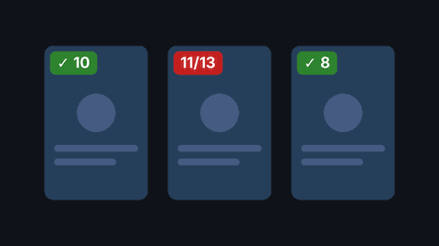

# Jellyfin Season Badge

[](https://github.com/M0l0k0plv5/jellyfin-season-badge/actions/workflows/ci.yml)



Shows at a glance whether a season or series is complete in your Jellyfin library.

- **✓ 13** (green): all aired episodes are present
- **11/13** (red): episodes are missing — hover for the exact count

Badges appear on season posters and on series posters in the library. Series badges count all seasons except Specials (configurable). Unaired episodes are ignored, so an ongoing season isn't flagged as incomplete. Inside a season, missing episodes are highlighted in the episode list.

<!--  -->

## Requirements

- Jellyfin 12.x (web client)
- A metadata provider that creates placeholders for missing episodes, enabled for your TV library (e.g. the TheTVDB plugin's *Missing Episode Fetcher*)
- **Display missing episodes within seasons** enabled in your user settings (Profile → Display)

If missing episodes don't show up inside a season in Jellyfin itself, there is nothing to count. The plugin's settings page warns you when no placeholders exist.

## Installation (plugin, recommended)

The plugin injects the script into the web client through the [File Transformation](https://github.com/IAmParadox27/jellyfin-plugin-file-transformation) plugin, so no files of your Jellyfin installation are modified.

1. Dashboard → Plugins → Repositories → add both:
   - `https://www.iamparadox.dev/jellyfin/plugins/manifest.json`
   - `https://github.com/M0l0k0plv5/jellyfin-season-badge/releases/latest/download/manifest.json`
2. Catalog → install **File Transformation** and **Season Badge**.
3. Restart Jellyfin and hard-refresh your browser (`Ctrl+Shift+R`).

### Settings

Dashboard → Plugins → Season Badge:

- badges on season posters, series posters, or both
- count specials in series badges
- only show badges when episodes are missing
- highlight missing episodes in episode lists
- badge position and colors
- enable or disable per TV library
- exclude individual series (e.g. shows you only want one season of)

Reload the web client after saving.

### Incomplete series overview

Dashboard → **Incomplete Series** (sidebar, under Plugins) lists every series with missing aired episodes and the affected seasons. Expand a series to see each missing episode (`S02E05 - Title (air date)`), copy the list, or export everything as CSV. Sort by most missing, least complete or name, filter by title, and click **Ignore** to exclude a series.

## Installation (script only)

No plugin, no settings: paste [`season-badge.js`](season-badge.js) into the [JavaScript Injector](https://github.com/n00bcodr/Jellyfin-JavaScript-Injector) plugin and hard-refresh your browser. Don't use both methods at the same time.

## How it works

With the plugin, the web client sends the ids of all visible season and series posters to the server in one request (`GET /SeasonBadge/Stats`). The server counts per season and series:

- **have** — episodes with a file on disk
- **total** — have + missing episodes that have already aired

Counts are cached on the server and refreshed automatically when episodes, seasons or series change. In script-only mode the browser fetches each series' episodes itself.

Nothing in your library is changed; the plugin only reads data.

## Troubleshooting

- **No badges:** check that missing episodes are visible inside a season first. Make sure File Transformation is installed and the *Season Badge Startup* task ran (Dashboard → Scheduled Tasks). Then open the browser console (`F12`) and look for `[season-badge]` messages.
- **Every season shows as complete:** placeholders haven't been created yet. Run *Refresh metadata* on the series or library.
- **Badges gone after a Jellyfin update:** the web client's markup may have changed. Please open an issue with your Jellyfin version.

## Limitations

- Web client only. Native TV apps won't show badges.
- Episodes without an air date are treated as unaired.
- The missing-episode highlight needs a browser with CSS `:has()` support (all current browsers).

## Development

```sh
npm install && npm test        # web client tests (Node 22+)
dotnet build src/Jellyfin.Plugin.SeasonBadge
./release.sh 1.2.3             # build and publish a GitHub release (needs the .NET 10 SDK and gh)
```

CI builds the plugin against Jellyfin 12.0 and the latest 12.x release on every push and once a week, and runs the tests.

## License

MIT
